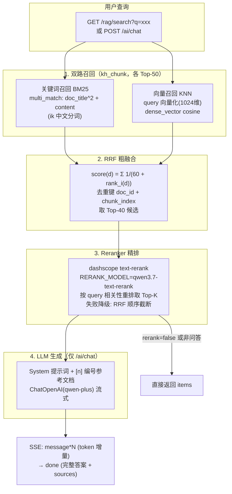

# RAG 检索问答工单：/rag/search 混合检索 + /ai/chat 流式问答

> 完成日期：2026-09-18
> 关联架构图：基于 Elasticsearch 的混合检索（关键词 + 向量）——双路召回 → RRF 融合 → Reranker 精排 → LLM 生成

## 一、需求背景

在既有 RAG 写入链路（文档发布 → rag.queue → 切块 → 向量化 → `kh_chunk` 索引）基础上，补齐**检索侧**与**问答侧**能力：

1. `GET /rag/search` — 混合检索接口，按架构图实现完整链路：关键词召回 + 向量召回 → RRF 融合 → Reranker 精排 → Top-K 上下文片段
2. `POST /ai/chat` — AI 问答接口：复用混合检索拿上下文，提示词 + 参考文档交给 LLM（qwen-plus）流式生成，SSE 推送 token 增量，结束事件携带完整答案 + 引用列表

已确认决策：
- Reranker 本工单完整实现（dashscope 原生 HTTP API，模型 `RERANK_MODEL=qwen3.7-text-rerank`），失败降级为 RRF 排序
- SSE 采用 POST + 手写 `res.write`（Nest `@Sse()` 强制 GET 路由，question 中文走 body 更稳）
- 问答路径为 `/ai/chat`（AI 接口），检索路径保留 `/rag/search`（RAG 链路）

## 二、整体链路



**检索侧数据源**：`kh_chunk`（`doc_id / doc_title / chunk_index / content / embedding(dense_vector 1024, cosine) / created_at`），由既有 RAG 写入管线在文档发布时灌入（`src/pipeline/pipeline.service.ts`）。

## 三、新增/修改文件

### 新增 src/rag/（8 个文件）

| 文件 | 职责 |
| --- | --- |
| `rag.module.ts` | 模块注册；EmbeddingService 直接实例化（PipelineModule 未导出，服务无状态可复用类） |
| `rag.controller.ts` | `GET /rag/search`（登录态，无 @Public） |
| `ai.controller.ts` | `POST /ai/chat`（SSE；`@Res()` 手写响应，`Response` 需 `import type` —— isolatedModules + emitDecoratorMetadata 约束） |
| `dto/rag-search.dto.ts` | q(1-100) / top_k(1-20 默认 5) / rerank(bool 默认 true，@Transform 显式映射，避开 `@Type(()=>Boolean)` 对 'false' 的误判坑) |
| `dto/rag-chat.dto.ts` | question(1-500) / top_k(1-10 默认 5) |
| `rag-search.service.ts` | 混合检索编排 + 导出纯函数 `rrfFuse`；双路各召回 50 条 → RRF(k=60) 去重融合 → 候选 `min(topK*4, 40)` → 重排/降级 |
| `rerank.service.ts` | dashscope 原生 rerank（原生 fetch，不引 axios）；`RERANK_API_URL` 可覆盖默认端点；10s 超时 AbortController；任何失败 warn + 返回 null 降级 |
| `ai-chat.service.ts` | SSE 流式问答：检索上下文 → 提示词 → `llm.stream()` 异步迭代 → `event: message` 增量 → `event: done` 完整答案+sources；检索 0 结果直接 done 提示不调 LLM |

### 修改（4 处）

| 文件 | 改动 |
| --- | --- |
| `src/es/vector-index.service.ts` | 新增 `knnSearch(queryVector, k)`（knn clause, num_candidates=max(2k,100)）与 `textSearch(q, size)`（multi_match `doc_title^2, content`）；导出 `ChunkHit` 接口 |
| `src/app.module.ts` | imports 追加 `RagModule` |
| `.env` | 追加 `RERANK_MODEL=qwen3.7-text-rerank` |
| `test/curl/payload/curl.md` | 新增 §21（含夹具 `rag-search-q.txt` / `ai-chat.json` / `login.json`） |

## 四、接口契约

### GET /rag/search（需 Bearer token）

```
GET /rag/search?q=知识库&top_k=3&rerank=true
```

```json
{
  "items": [
    {
      "doc_id": "7504813748293472256",
      "doc_title": "吴金远_前端开发_简历_2026",
      "chunk_index": 2,
      "content": "计算机基础：HTTP/HTTPS……",
      "score": 0.690736798183375,
      "rank": 1
    }
  ],
  "took_ms": 1083
}
```

- `rerank=true`：score 为重排相关性得分（0~1）；`rerank=false` 或重排降级：score 为 RRF 融合分（≈1/(60+rank) 量级）

### POST /ai/chat（需 Bearer token，SSE 响应）

请求体 `{"question":"...","top_k":3}`；响应 `Content-Type: text/event-stream`：

| 事件 | data | 说明 |
| --- | --- | --- |
| `message` | `{"delta":"token 增量"}` | 多次推送 |
| `done` | `{"answer":"完整答案","sources":[{doc_id,doc_title,chunk_index,score,rank}]}` | 流结束 |
| `error` | `{"message":"AI 服务处理失败，请稍后重试"}` | 失败后关闭连接 |

检索 0 结果（如 kh_chunk 索引为空）时直接发 `done(answer=提示语, sources=[])`，不调用 LLM。

## 五、关键设计决策

| 决策 | 理由 |
| --- | --- |
| 双路召回都在 kh_chunk 上做 | kh_chunk 才有向量；同粒度 RRF 去重键天然统一（doc_id+chunk_index） |
| Reranker 用原生 fetch 调 dashscope 原生端点 | 重排模型非 OpenAI 兼容协议；模型名走 `RERANK_MODEL` 环境变量，与 EMBEDDING_MODEL 配置风格一致 |
| rerank 失败降级不 500 | 精排是增强而非依赖（项目惯例：ES 清理失败不阻塞删除）；单测钉住降级行为 |
| POST 手写 SSE 而非 @Sse() 装饰器 | @Sse() 强制 GET 路由无法收 POST body；question 中文走 query 有 GBK 编码坑（项目实测踩过）+ URL 长度限制 |
| 检索 0 结果不调 LLM | 省 token；返回固定提示 |
| v1 无权限过滤、单轮对话 | kh_chunk 无 status/is_public 字段，权限过滤无从谈起；记 TODO |

## 六、配置项

| 环境变量 | 默认值 | 说明 |
| --- | --- | --- |
| `RERANK_MODEL` | `qwen3.7-text-rerank` | dashscope 重排模型 |
| `RERANK_API_URL` | `https://dashscope.aliyuncs.com/api/v1/services/rerank/text-rerank/text-rerank` | 重排端点（代码内默认，可 env 覆盖） |
| `OPENAI_API_KEY` | — | 复用（dashscope key 通用：embedding/LLM/rerank） |
| `EMBEDDING_BASE_URL` | — | 复用（LLM 与 embedding 同端点 compatible-mode） |
| `LLM_MODEL` | `qwen-plus` | 问答生成模型 |

## 七、验证记录（2026-09-18）

| 验证项 | 结果 |
| --- | --- |
| `pnpm build` | 0 error |
| `pnpm test` | **57/57 通过**（新增 8 例：rrfFuse 打分/去重/排序 3 例，search 编排重排成功/降级/关闭/空结果 4 例，RerankService fetch 成功/400/抛错/格式异常 4 例） |
| GET /rag/search?q=知识库（rerank 默认） | 200，3 条 items，score 为相关性得分（0.69/0.59/0.58），took 1083ms |
| GET /rag/search&rerank=false | 200，score 为 RRF 分（0.0164/0.0161），顺序与重排版不同（精排生效的对照证据） |
| 无 token 访问 /rag/search、/ai/chat | 401 |
| POST /ai/chat（curl -N） | 51 条 `event: message` 逐 token 输出 + 1 条 `event: done`，answer 带 `[n]` 引用标注，sources 含 doc_id/doc_title/chunk_index/score/rank |
| LLM 拒答路径 | 乱码问题 → answer「知识库中暂无相关内容」，上下文不足时明确说明（提示词约束生效） |

> 注：`kh_chunk` 有数据时 knn 总能返回 Top-K，「检索 0 结果」分支主要防御索引为空的冷启动场景，单测以 mock 覆盖。

## 八、TODO（后续工单）

- [ ] chunk 级权限过滤：kh_chunk 索引补 status/is_public/team_id 字段（写入管线同步扩展），检索时加 bool.filter
- [ ] 多轮对话记忆：conversationId + 历史消息窗口
- [ ] 重排候选上限可配置化（当前固定 min(topK*4, 40)）
- [ ] SSE 客户端断连（req close）时中断 LLM 流，避免白烧 token
