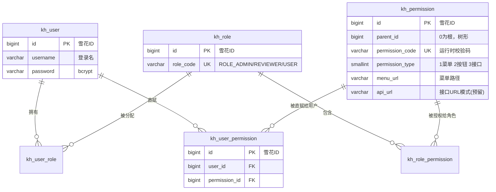

# RBAC 权限模块工单

> 状态：已实现并验证（2026-09-17）
> 关联表：`init-scripts/postgresql/init.sql#L102-184`
> 代码：`src/auth/`（实体 / 装饰器 / PermissionService / PermissionsGuard）

## 1. 背景与目标

在既有 JWT 登录（401）+ 角色校验（403）之上，落地完整 RBAC 权限模型：

| 参考图                         | 目标                                         | 本项目落点                                     |
| ------------------------------ | -------------------------------------------- | ---------------------------------------------- |
| 图1/图2 RBAC 模型 + 用户直赋   | 用户权限 = 角色权限 ∪ 直赋权限（去重合并）   | `PermissionService.getUserPermissionCodes`     |
| 图3 三级权限（菜单/按钮/接口） | 菜单、按钮供前端渲染；接口由 Guard 校验      | `GET /auth/permissions` + `@RequirePermission` |
| 图4 全局 Guard 顺序            | JwtAuthGuard → RolesGuard → PermissionsGuard | `AuthModule` 三个 APP_GUARD 按序注册           |

## 2. 数据模型（图2 → ER 图）



**关键约束**：`permission_code` 全表 UNIQUE（一码一行）→ 接口级校验直接复用按钮级码；`type=3`（api_url+method，URL 模式统一拦截）表结构已预留，本期不启用。

**预置数据**（init.sql）：5 根菜单 + 4 子菜单 + 8 按钮码；ROLE_USER 得 dashboard/document/search/profile + 文档增删改查码；ROLE_REVIEWER 得 document:list + document:review + search；ROLE_ADMIN 无授权行 —— 走 Guard 旁路（Admin 拥有所有权限）。直赋演示：reviewer 直赋 `document:create`（kh_user_permission 一行）。

## 3. 全局 Guard 执行流程（图4 → 流程图）

```mermaid
flowchart TD
    REQ[请求进入 API] --> G1①
    subgraph G1["① JwtAuthGuard"]
        A1{标记 @Public?} -->|是| A2[免验 token 放行]
        A1 -->|否| A3{JWT token 有效?}
        A3 -->|否| A4[401 Unauthorized 未登录]
        A3 -->|是| G2①
    end
    subgraph G2["② RolesGuard"]
        B1{标记 @Roles?} -->|否| B2[跳过放行]
        B1 -->|是| B3{角色命中其一?}
        B3 -->|否| B4[403 Forbidden 角色不足]
        B3 -->|是| G3①
    end
    subgraph G3["③ PermissionsGuard"]
        C1{标记 @RequirePermission?} -->|否| C2[放行 不查库]
        C1 -->|是| C3{ROLE_ADMIN?}
        C3 -->|是| C4[Admin 直接放行]
        C3 -->|否| C5{拥有所需权限码?}
        C5 -->|是| OK[处理请求]
        C5 -->|否| C6[403 Forbidden 权限不足]
    end
```

**注册顺序即执行顺序**（`src/auth/auth.module.ts`）：`APP_GUARD` 依次 JwtAuthGuard、RolesGuard、PermissionsGuard。

**设计决策**：
- 权限码**按需实时查询**（仅标注接口查库，未标注零开销），不进 JWT / userInfo / `/auth/me` —— 与「每请求实时重查角色」同哲学，权限变更即时生效
- any-of 语义：命中任一所需权限码即放行（与 RolesGuard 一致）
- `@Roles` 与 `@RequirePermission` 可叠加（审核接口双保险）

## 4. 三级权限落点（图3）

| 级别   | 控制什么           | 实现                                                                   | 数据来源                          |
| ------ | ------------------ | ---------------------------------------------------------------------- | --------------------------------- |
| 菜单级 | 用户能看到哪些菜单 | 前端渲染 `GET /auth/permissions` 返回的 `menus` 树（含祖先链，防悬挂） | type=1 行                         |
| 按钮级 | 页面上哪些按钮可见 | 前端按 `buttons` 码数组控制显隐                                        | type=2 行                         |
| 接口级 | 能否调用后端接口   | `@RequirePermission('document:create')` + PermissionsGuard，未命中 403 | permission_code（复用 type=2 行） |

## 5. 核心代码

**装饰器** `src/auth/decorators/require-permission.decorator.ts`
```ts
export const PERMISSION_KEY = 'permissions';
export const RequirePermission = (...codes: string[]) => SetMetadata(PERMISSION_KEY, codes);
```

**Guard** `src/auth/guards/permissions.guard.ts`（未标注放行 → 无 user 放行 → Admin 旁路 → any-of 命中放行 → 403）
```ts
const requiredCodes = this.reflector.getAllAndOverride<string[]>(PERMISSION_KEY, [handler, class]);
if (!requiredCodes?.length) return true;                    // 未标注：零开销放行
if (!user) return true;                                     // 401 归 JwtAuthGuard 管
if (user.roles?.includes(ADMIN_ROLE_CODE)) return true;     // Admin 拥有所有权限
const owned = await this.permissionService.getUserPermissionCodes(user.userId);
if (requiredCodes.some((c) => owned.includes(c))) return true;
throw new ForbiddenException(`无权限操作，需要权限之一：${requiredCodes.join(' / ')}`);
```

**权限合并** `src/auth/permission.service.ts`（4 次查询：用户角色 → 角色权限 ∪ 直赋权限 → 权限明细 status=1 + deleted=false）
```ts
const permIds = [...new Set([
  ...rolePermLinks.map(l => l.permission_id),   // 角色权限（主体方式）
  ...userPermLinks.map(l => l.permission_id),   // 直赋权限（补充方案）
])];
// kh_permission where id In(permIds) AND status=1 AND deleted=false
```

**菜单树**：用户命中的 type=1 菜单沿 `parent_id` 补全祖先链后组树（子菜单可见 ⇒ 父菜单必现）。

**试点标注** `src/document/document.controller.ts`（5 处）：
| 端点                       | 权限码                     |
| -------------------------- | -------------------------- |
| POST /document             | document:create            |
| PATCH /document/:id        | document:edit              |
| POST /document/:id/approve | document:review（+@Roles） |
| POST /document/:id/reject  | document:review（+@Roles） |
| DELETE /document/:id       | document:delete            |

**权限查询端点** `GET /auth/permissions`（需登录）：
```json
{ "codes": ["…全量权限码"], "menus": [ { "permissionCode": "system", "menuUrl": "/admin", "icon": "…", "children": [ … ] } ], "buttons": ["document:create", …] }
```

## 6. 验证矩阵（curl.md 第 18 节）

| 账号     | POST /document（create） | POST /document/:id/approve | DELETE /document/:id | 预期说明                                                   |
| -------- | ------------------------ | -------------------------- | -------------------- | ---------------------------------------------------------- |
| admin    | 201                      | 200                        | 200                  | ROLE_ADMIN 旁路（无授权行也全通过；POST 默认 201 Created） |
| user     | 201                      | 403                        | 200                  | approve 被 RolesGuard 拦（角色不足）                       |
| reviewer | 201                      | 200                        | 403                  | create 经直赋生效；delete 未授权 403 权限不足              |

单测：`permission.service.spec.ts`（5 例）+ `permissions.guard.spec.ts`（6 例），auth 合计 32/32 通过。

## 7. 后续迭代（本期不做）

1. 管理端 CRUD：权限表管理 + 角色授权 / 用户直赋分配接口（system:permission:* 码已预置）
2. type=3 接口权限行（api_url + method）→ URL 模式统一拦截（无装饰器兜底）
3. 权限码 Redis 缓存（TTL + 变更失效），降低标注接口的每请求查询
4. @RequirePermission 全量铺开（upload 归入 document:create；search/admin 模块）
