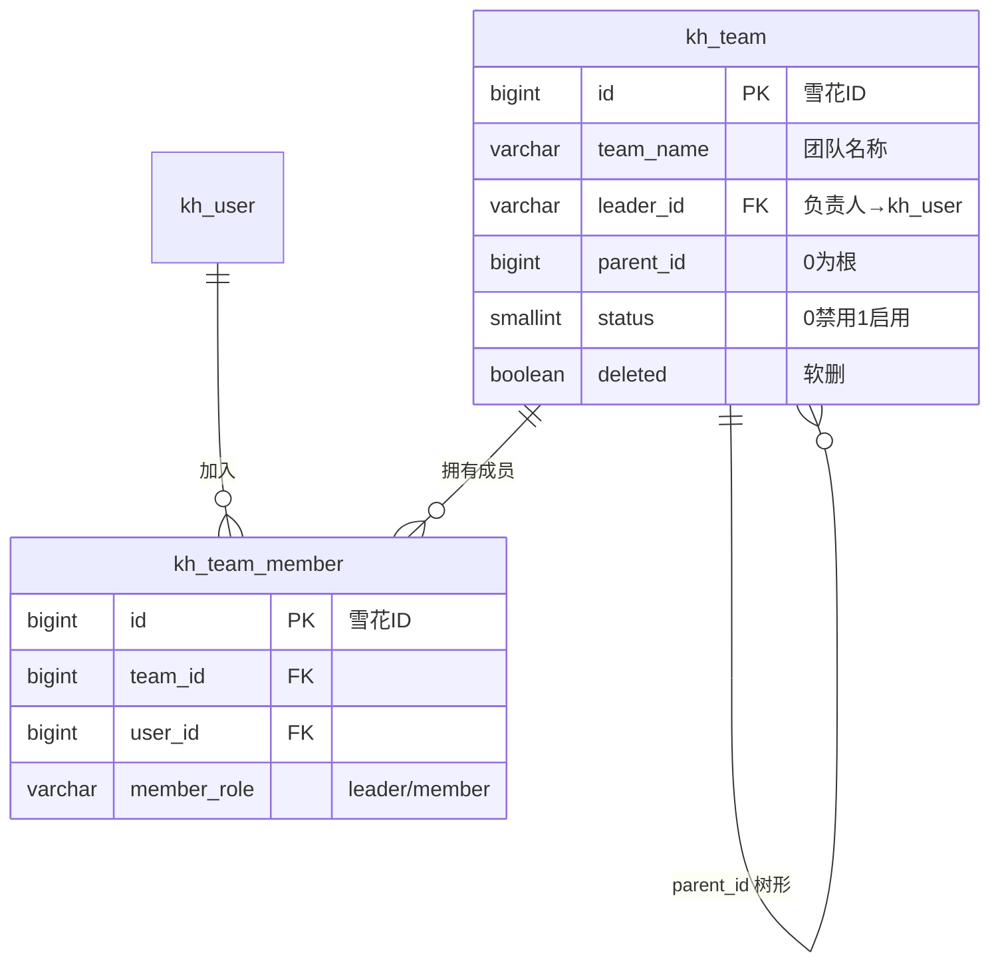

# 团队模块工单

> 状态：已实现并验证（2026-09-17）
> 关联表：`init-scripts/postgresql/init.sql#L187-238`（kh_team / kh_team_member + team:* 权限种子）
> 代码：`src/team/`（实体 / DTO / TeamService / TeamController）

## 1. 背景与目标

kh_team（知识库空间载体，支持树形组织）/ kh_team_member（成员关联，UNIQUE(team_id,user_id)）两表早已在 init.sql 落库，代码侧为空。本工单补齐：实体 + DTO + 团队 CRUD + 成员管理（增删查改），并接入 RBAC 权限体系（复用 type=2 权限码 + @RequirePermission + 全局三 Guard）。

## 2. 数据模型



**关键点**：关联表无软删列（移除成员 = 硬删行）；团队名不唯一（无约束不查重）；`kh_document.team_id` 预留文档归属团队的关联（本期不联动）。

## 3. 接口与权限对照（/team）

| 方法 | 路径 | 权限码 | 说明 |
|---|---|---|---|
| POST | /team | team:create | leader_id 缺省取当前登录用户（建团人默认负责人） |
| GET | /team | —（登录即可） | 分页 `{items,total,page,pageSize}`；team_name 模糊 |
| GET | /team/:id | —（登录即可） | 详情，404 兜底 |
| PATCH | /team/:id | team:edit | 部分更新 + status 启停 |
| DELETE | /team/:id | team:delete | 软删；**种子未授权任何角色，仅 Admin 旁路可删**（权限收敛演示） |
| POST | /team/:id/members | team:member | 添加成员，重复 409 |
| GET | /team/:id/members | —（登录即可） | 联 kh_user 返回 username/realName |
| PATCH | /team/:id/members/:userId | team:member | leader/member 互切 |
| DELETE | /team/:id/members/:userId | team:member | 移除成员（硬删） |

**种子**（parent = system:team 菜单 4000000000000000024）：team:create(051)/edit(052)/delete(053)/member(054)；ROLE_USER 授权 create/edit/member（4100000000000000012-014）；ROLE_REVIEWER 无 team 权限（403 对照）。

## 4. 核心代码摘录

**异常码兜底**（team.service.ts，对齐 document 模块）：
```ts
// create：负责人/父团队不存在
catch (err) { if (err?.code === '23503') throw new BadRequestException('负责人或父团队不存在'); }
// addMember：重复成员
catch (err) { if (err?.code === '23505') throw new ConflictException(`用户 ${userId} 已是团队成员`); }
```

**建团默认负责人**：
```ts
leader_id: dto.leader_id ?? user.userId,   // @CurrentUser 注入
```

**成员列表联查**（两步 In 查询，风格对齐 UserService.getRoleCodes）：
```ts
const members = await this.memberRepo.find({ where: { team_id: id } });
const users = await this.userRepo.find({ where: { id: In(members.map(m => m.user_id)) } });
```

## 5. 验证矩阵（curl.md 第 19 节）

| 账号 | POST /team | DELETE /team/:id | 成员管理 | 预期说明 |
|---|---|---|---|---|
| admin | 201 | 200 | 200 | ROLE_ADMIN 旁路（无 team 授权行也全通过） |
| user | 201 | 403 | 200 | team:delete 无授权行 → 权限层 403 |
| reviewer | 403 | 403 | 403 | 无任何 team:* 权限码 |

单测：`team.service.spec.ts` 10 例（默认负责人 / 23503→400 / 23505→409 / 404 / 软删过滤 / 联查）。

## 6. 后续迭代（本期不做）

1. leader 数据权限：仅负责人或 Admin 可改/删自己团队（当前为权限码级控制）
2. 「最后一个 leader」保护：禁止移除/降级团队唯一 leader
3. GET /team/my：我所在的团队（kh_team_member by user_id）
4. kh_document.team_id 联动：团队空间内文档隔离/共享
5. 团队树查询（parent_id 递归组树）
